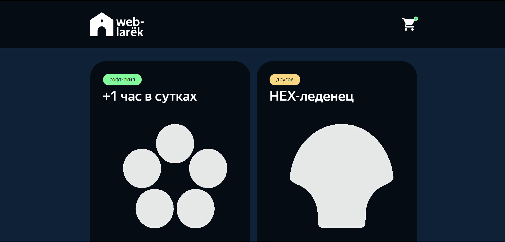
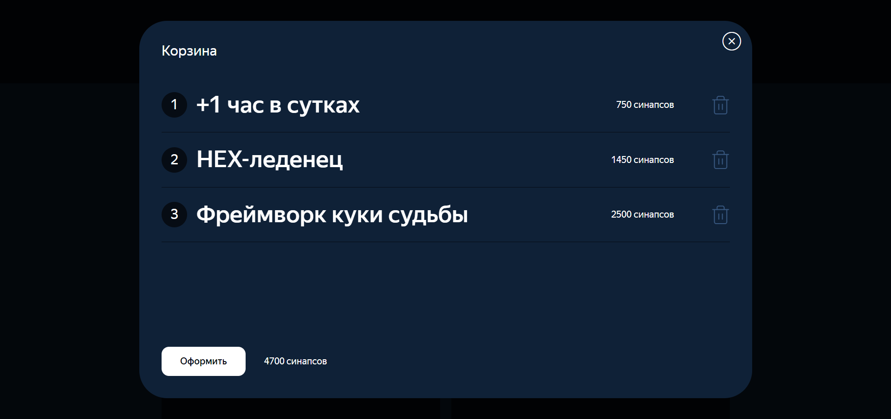
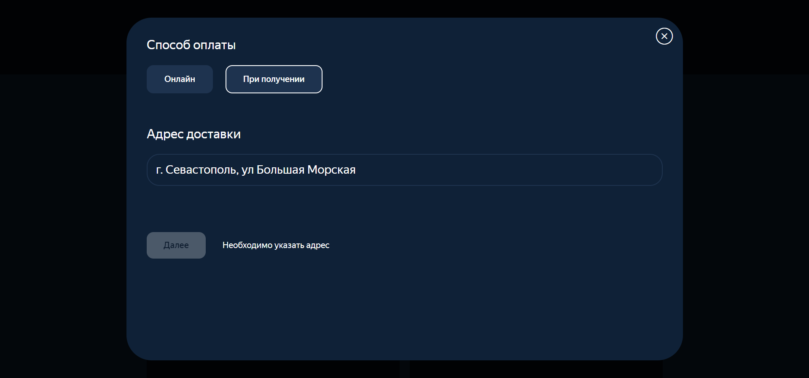
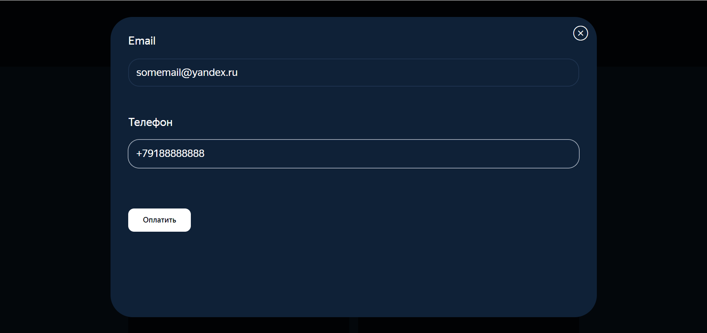
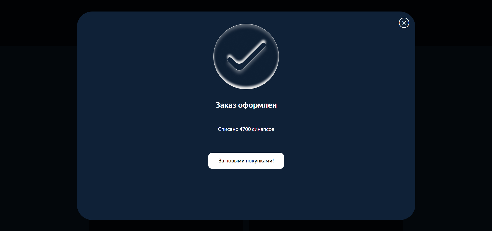

# Проектная работа "Веб-ларек"

Стек: HTML, SCSS, TS, Webpack

Структура проекта:
- src/ — исходные файлы проекта
- src/components/ — папка с JS компонентами
- src/components/base/ — папка с базовым кодом

Важные файлы:
- src/pages/index.html — HTML-файл главной страницы
- src/types/index.ts — файл с типами
- src/index.ts — точка входа приложения
- src/scss/styles.scss — корневой файл стилей
- src/utils/constants.ts — файл с константами
- src/utils/utils.ts — файл с утилитами

## Установка и запуск
Для установки и запуска проекта необходимо выполнить команды

```
npm install
npm run start
```

или

```
yarn
yarn start
```
## Сборка

```
npm run build
```

или

```
yarn build
```

## Пример интерфейса проекта
### Главная 

### Модальное окно карточки

### Корзина с товарами

### Выбор способа оплаты

### Контактные данные

### Успешная покупка 

## Типы данных 

Интерфейс для описания карточки товара 

```
interface IProductItem {
  id: string;
  description: string;
  image: string;
  title: string;
  category: string;
  price: number | null;
  selected: boolean;
}
```
Интерфейс для описания карточки товара на странице 
```
interface ICard {
  description: string;
  image: string;
  title: string;
  category: string;
  price: number | null;
}
```
Интерфейс для описания полей заказа
```
interface IOrder {
  items: string[]
  total: number;
  payment: string;
  adress: string;
  email: string;
  phone: string;
}
```
Интерфейс использующийся для получения списка карточек с сервера
```
interface ApiResponse {
  items: IProductItem[];
}
```
Интерфейс хранящий в себе состояния приложения, хранящий данные карточек, корзины, заказов и ошибки валидации.\
Имеет методы работы с карточками и корзиной, описание каждого приведено ниже.
```
interface IAppState {
  Массив товаров в корзине 
  basket: IProductItem[];

  Массив товаров на странице
  page: IProductItem[];

  Информация о заказе
  order: IOrder;

  Форма ошибок
  formErrors: FormErrors;

  Метод для добавления товара в корзину
  addToBasket(value:Product): void;

  Метод для удаления товара из корзины
  deleteFromBasket(id:string): void;

  Очистить корзину
  clearBasket(): void;

  Получить кол-во товаров в корзине
  getBasketCount(): number;

  Получить общую сумму товаров в корзине
  getTotalBasket(): number;

  Очистить форму заказа после оформления покупки
  clearOrder(): boolean;

  Добавление ID товарам в корзине для заказа
  setItems(): void;

  Преобразование данных с сервера в тип приложения
  setStore(items: IProductItem[]): void;

  Обновление полей заказа после покупки
  resetSelected(): void;

  Валидация формы контактов
  validationContacts(): boolean;

  Валидация формы заказов
  validationOrder(): boolean;

  setOrderField(field: keyof IOrderForm, value: string): void;
}
```

Тип полей заказа
```
type IOrderForm = Pick<IOrder, 'payment'|'adress'|'email'|'phone'>
```
Тип категорий товаров
```
type Category = 'софт-скил'|'другое'|'доролнительное'|'кнопка'|'хард-скил' 
```
Тип валидации ошибок форм 
```
type FormErrors = Partial<Record<keyof IOrderForm, string>>;
```
## Архитектура приложения

### Базовый код

#### Класс Api
Содержит в себе базовую логику отправки запросов. В конструктор передается базовый адрес сервера и опциональный объект с заголовками запросов.
Методы: 
- `get` - выполняет GET запрос на переданный в параметрах ендпоинт и возвращает промис с объектом, которым ответил сервер
- `post` - принимает объект с данными, которые будут переданы в JSON в теле запроса, и отправляет эти данные на ендпоинт переданный как параметр при вызове метода. По умолчанию выполняется `POST` запрос, но метод запроса может быть переопределен заданием третьего параметра при вызове.

#### Класс EventEmitter
Брокер событий позволяет отправлять события и подписываться на события, происходящие в системе. Класс используется в презентере для обработки событий и в слоях приложения для генерации событий.  
Основные методы, реализуемые классом описаны интерфейсом `IEvents`:
- `on` - подписка на событие
- `emit` - инициализация события
- `trigger` - возвращает функцию, при вызове которой инициализируется требуемое в параметрах событие 

#### Класс `Component<T>`

Абстрактный класс дженерик содержащий методы для работы с компонентами отображения, принимает в конструкторе `container` типа `HTMLElement`\
Основные методы реализуемые классом:
- `toggleClass()` - переключение класса элемента
- `setDisabled()` - смена статуса блокировки
- `setHidden()` - скрыть элемент
- `setVisible()` - сделать элемент видимым
- `setImage()` - установить изображение с альт текстом
- `render()` - метод рендеринга элемента

#### Класс `Model<T>`

Абстрактный класс дженерик использующийся для отличия базовой модели от простых объектов с данными.\
В конструкторе принимает  объект данных `data`  и `events: IEvents`.
Имеет метод ` emitChanges()`, который регистрирует событие в `EventEmiter`


### Компоненты модели данных

#### Класс `AppState`

Этот класс содержит основные данные страницы и методы работы с элементами.

Расширяется моделью `Model<T>` по интерфейсу `IAppState`\
##### Методы класса:
- `addToBasket()` - довавить товар в корзину
- `deleteFromBasket()` - удалить товар из корзины
- `clearBasket()` - очистить корзину
- `getBasketAmount()` - получить количество товаров в корзине
- ` getTotalBasketPrice()` - получить общую сумму товаров в корзине
- `refreshOrder()` - очистить форму заказа после совершения покупки
- `setItems()` - добавление ID товарам в корзине
- `setStore()` - преобразование данных с сервера в тип приложения
- `resetSelected()` - обновление полей заказа после покупки
- `validationContacts()` - валидация формы контактов
- `validationOrder()` - валидация формы заказа
- `setOrderField()` - заполнение полей формы заказов

#### Класс `Product` 

Данный класс предназначен для хранения данных товара, расширяеться 
классом `Model<T>` по интерфейсу `IProductItem`


### Классы представления

Класс `Card`

Реализует отображение данных карточки на странице каталога.\
Расширяеться абстрактным классом `Component<T>` по интерфейсу `ICard`\
Конструктор принимает `BlockName` - префикс css блока, `container` с типом `HTMLElement` и опциональный объект событий `action` с колбэк функцией `IcardAction`\
##### Поля класса:
- `_title` - хранение разметки заголовка
- `_image` - хранение разметки изображения карточки
- `_category` - хранение разметки категории
- `_price` - хранение разметки цены
- `_button` - хранение разметки кнопки 

##### Методы класса: 
- `set id` - установка уникального id атрибута 
- `set image` - установка изображения
- `set title` - установка названия элементу
- `set category` - установка категории
- `set price` - установка цены 
- `get id` - получение id
- `get title` - получение названия жлемента

#### Класс `Page`

Данный класс отвечает за отображение данных на главной странице, таких как карточки, счётчик на корзине и сама корзина

Конструктор класса принимает `container` типа `HTMLElement` и `event` типа `IEvent`\

##### Поля класса: 
- `_counter`
- `_store`
- `wrapper`
- `_basket`

##### Методы класса:
- `set catalog` - установка каталога
- `set counter` - установка счётчика корзины
- `set locked` - установка блокировки прокрутки страницы 

#### Класс `Basket`

Класс отвечающий за отображение корзины в модальном окне

Конструктор класса принимает `BlockName` - префикс css блока, `container` типа `HTMLElement` и `event` интерфейс `OnClick`\

##### Поля класса:
- `_list` - хранит разметку списка товаров 
- `price` - разметка для суммы товаров
- `button` - разметка кнопки подтверждения

##### Методы класса:
- `set list` - устанавливает товары в разметку
- `set price` - устанавливает значение суммы товаров

- `disableButton()` - метод для блокировки кнопки оформления

- `refreshIndices()` - метод для одновления индексов товаров при удалении из корзины

#### Класс `Modal`

Класс для отображения модального окна
Расширяется классом `Component<T>` по интерфейсу `IModalData`

Конструктор принимает `container` типа `HTMLElement` и `event` типа `IEvent`

##### Поля класса:
- `_content` - разметка для контента модалки
- `_closeButton` - разметка кнопки закрытия 

##### Методы класса:

- `set content` - установка контента модалки
- `open` - открытие модалки
- `close` - закрытие модалки
- `render` - рендер модалки

 #### Класс `Contacts`

класс описывающий форму контактов\
Расширяется классом `Form<T>` по интерфейсу `IContacts` 
Конструктор принимает `container` типа `HTMLElement` и `event` типа `IEvent`\

#### Класс `Order`

Данный класс отвечает за форму заказа товара выбора способа оплаты и заполнения адреса доставки\
Расширяется классом `Form<T>` по интерфейсу `IOrder`.
Конструктор принимает `BlockName` - префикс css блока `container` типа `HTMLElement` и `event` типа `IEvent`

##### Поля класса:
 - `address` - поле ввода адреса
 - `payment` - разметка формы кнопок выбора способа оплаты

 ##### Методы класса:
 - `disableButtons()` - метод для переключения подсвечивания кнопки 

#### Класс `Success`
Данный класс служит для отображения успешного заказа в модалке

Конструктор принимает `BlockName` - префикс css блока, `container` типа `HTMLElement` и опциональный объект события `actions` типа `ISuccessActions`
```
interfase ISuccessActions {
  onClick:() => void
}
```
Расширяется классом `Component<T>` по интерфейсу `ISuccess
` 
##### Поля класса:
- `_button` - разметка кнопки подтверждения 
- `_description` -  разметка для вывода суммы заказа 

##### Методы класса:

 - `set description` -вывод суммы заказа


### Описание событый 

- `items:changed` - вызываеться при изменении списка товаров 
- `card:select` - вызываеться при нажатии на карточку для открытия модалки с описанием товара
- `card:toBasket` - вызываеться при нажатии на кнопку добавления товара в корзину и обновляет счётчик корзины и делает кнопку добавления данного товара неактиной 
- `basket:open` - вызываеться при нажатии на корзину и открывает модальное окно с товарами в ней
- `basket:delete` - вызывается при удалении товара из корзины, обновляет счётчик корзины, меняет статус кнопки на активный, обновляет сумму заказа в корзине
- `basket:order` - вызывается при нажатии на кнопку оформить в корзине и открывает модалку с заполнением адреса и способа оплаты
- `order:ready` - вызывается при нажатии кнопки подтверждения после заполнения адреса и способа оплаты и октрывает модальное окно с контактными данными
- `contacts:ready` - вызываеться при нажатии кнопки подтверждения после заполнения email и телефона
- `orderFormErrors:changed` - вызываеться при вводе данных в форме заказа и возвращает ошибки формы
- `contactsFormErrors:changed` - вызываеться при вводе данных в форме контактных даных и возвращает ошибки формы
- `orderInput:change` - вызываеться при изменении введённых данных
- `order:submit` - вызываеться при нажатии кнопки подтверждения и открывает окно формы контактов
- `order:success` - вызывается при успешном заказе и открывает модальное окно с сообщением об успешной оплате
- `modal:open` -  вызываеться при открытии модального окна
- `modal:close` - вызывается при клике на крестик модального окна или за пределами модалки